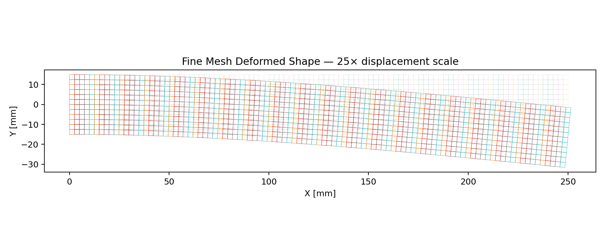

# Static FEA Ground-Truth Benchmark

A reproducible static-structural benchmark comparing finite-element predictions with closed-form cantilever-beam calculations.

## Problem
- Length: 250 mm
- Height: 30 mm
- Thickness: 10 mm
- Structural steel: E = 210 GPa, ν = 0.30
- Fixed left edge
- 600 N downward end load
- 2D plane-stress Q4 finite elements

## Analytical reference
- Root bending stress: **100.000 MPa**
- Tip deflection: **0.661376 mm**
- Nominal yield factor of safety: **2.500**

## Fine-mesh validation
- Tip deflection: **0.664841 mm** → **0.52% error**
- Matching-section bending stress error: **0.33%**
- Vertical reaction equilibrium: approximately exact
- Reaction moment equilibrium: approximately exact

The project includes the transparent solver, analytical calculation, convergence data, raw fine-mesh results and an ANSYS replication guide.
