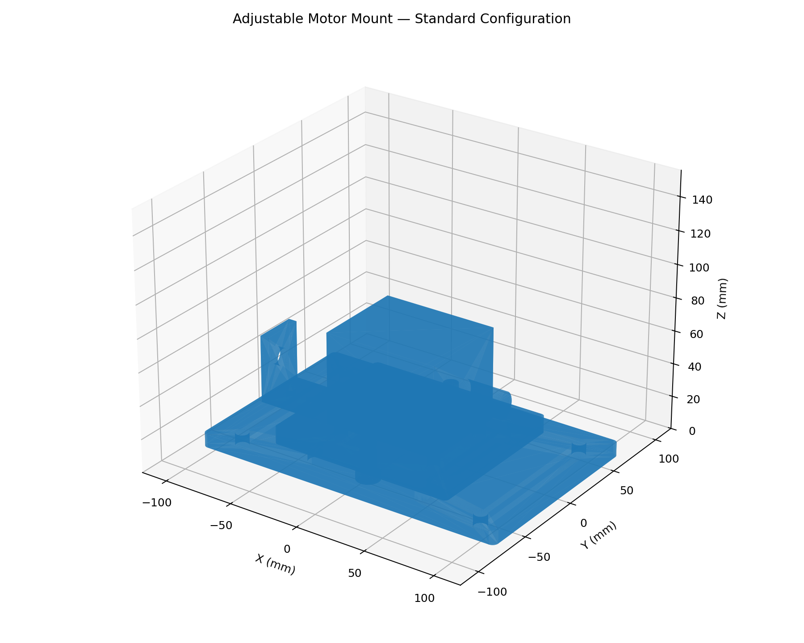
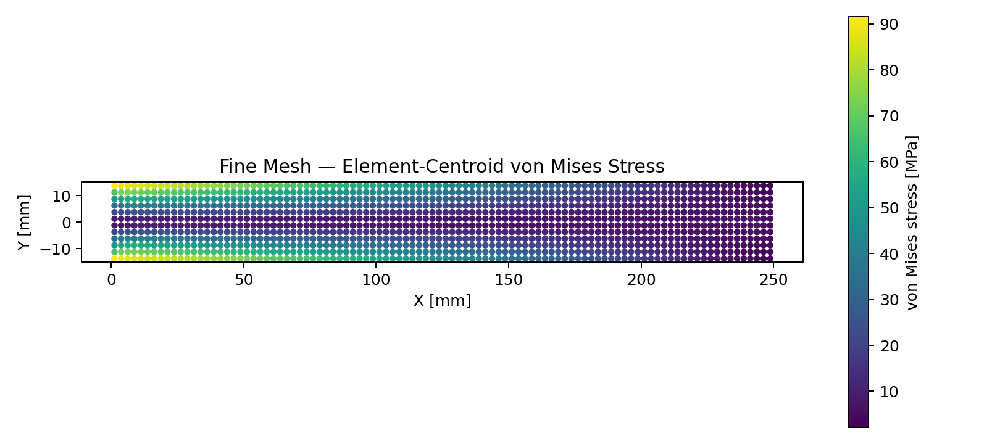

# Amr Awad — Mechanical Engineering Validation Portfolio

Mechanical Engineering graduate portfolio focused on **parametric CAD, FEA validation, thermal analysis, engineering automation, and mechanical design**.

The repository is intentionally organized around a simple engineering question: **can a design or simulation result be independently checked instead of merely accepted from the software?**

[LinkedIn](https://www.linkedin.com/in/amr-awad-16b2a7278/) · Email: amrawad0595@gmail.com · [Portfolio PDF](docs/Amr_Awad_Engineering_Portfolio.pdf)

## Featured projects

### 1. Automated Engineering Evaluation Harness — Python


A deterministic evaluation pipeline that consumes CAD, static-FEA and thermal-validation outputs and produces configurable **PASS/FAIL decisions, weighted scores, JSON/CSV reports, SHA-256 input fingerprints, and unit-tested repeatability**.

**Highlights:** baseline **99.3/100 PASS**; deliberately corrupted engineering results **44.818/100 FAIL**.

[Open project →](projects/01-engineering-evaluation-harness/)

### 2. Parametric CAD Validation Benchmark — CadQuery / STEP


Adjustable motor-mount benchmark with Compact, Standard and Extended configurations, controlled travel, deterministic geometry checks and intentionally invalid parameter cases for CAD-debugging practice.

**Focus:** parametric design, configurations, clearances, interference logic, geometry validity and reusable CAD data.

[Open project →](projects/02-parametric-cad-validation/)

### 3. Static FEA Ground-Truth Benchmark


Cantilever benchmark comparing a transparent finite-element model against closed-form beam theory, including mesh convergence and reaction-equilibrium checks.

**Fine-mesh results:** tip-deflection error **0.52%**; sampled bending-stress error **0.33%**.

[Open project →](projects/03-static-fea-ground-truth/)

### 4. Thermal FEA Ground-Truth Benchmark


Aluminum cooling-fin benchmark comparing numerical finite-element predictions against an analytical fin solution and energy conservation.

**Fine-mesh results:** tip-temperature error **0.0012%**; heat-flow error **0.0015%**.

[Open project →](projects/04-thermal-fea-ground-truth/)

### 5. Compact Scissor Lift — Mechanical Design Study


Virtual mechanical-design project covering requirements, CAD assembly, kinematics, analytical loading, lead-screw sizing, BOM, manufacturing profiles and concept-stage validation.

**Design target:** centered payload **10 kg**. This is a virtual design study; it was not physically manufactured or proof-load tested.

[Open project →](projects/05-compact-scissor-lift/)

## Technical areas demonstrated

- **CAD:** SolidWorks-compatible STEP workflows, CadQuery, AutoCAD/DXF, assemblies, parametric configurations
- **Simulation:** FEA fundamentals, static structural analysis, thermal analysis, mesh convergence
- **Validation:** analytical ground truth, equilibrium checks, energy balance, deterministic acceptance rules
- **Programming:** Python, NumPy, SciPy, pandas, unit testing, JSON/CSV engineering pipelines
- **Mechanical design:** kinematics, load calculations, lead-screw sizing, BOM and manufacturing documentation

## Repository map

```text
projects/
  01-engineering-evaluation-harness/
  02-parametric-cad-validation/
  03-static-fea-ground-truth/
  04-thermal-fea-ground-truth/
  05-compact-scissor-lift/
assets/
docs/
```

## Reproducing the Python work

Create a virtual environment and install the dependencies in `requirements.txt`. CadQuery installation can vary by platform; its official conda package is often the easiest route for the CAD project.

```bash
python -m venv .venv
# activate the environment, then:
pip install -r requirements.txt
```

The evaluation harness itself uses only the Python standard library.

## Engineering note

These projects are portfolio and validation studies. Results and assumptions are documented in each project. They should not be treated as certified production designs or safety approvals.
