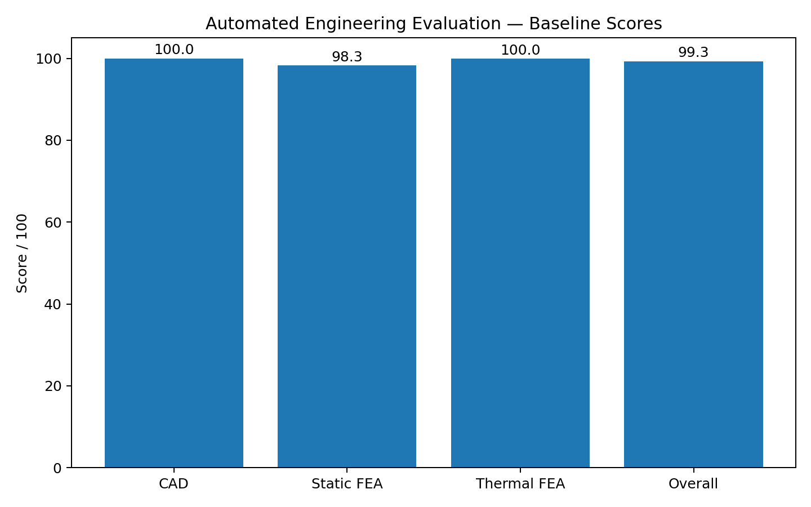

# Automated Engineering Evaluation Harness

A deterministic Python pipeline that evaluates validation outputs from the CAD, static-FEA and thermal benchmarks.



## What it does
- Reads CAD, structural and thermal validation JSON files.
- Applies configurable acceptance rules and domain weights.
- Produces domain scores, an overall score and PASS/FAIL status.
- Writes machine-readable JSON, compact CSV and a Markdown engineering report.
- Stores SHA-256 fingerprints of the inputs and rule configuration.
- Includes intentionally corrupted inputs and unit tests for repeatability.

## Included results
- **Baseline:** 99.3/100 — PASS
- **Failure cases:** 44.818/100 — FAIL

## Run
```bash
python source/evaluation_harness.py \
  --cad inputs/Baseline/cad_validation.json \
  --static inputs/Baseline/static_validation.json \
  --thermal inputs/Baseline/thermal_validation.json \
  --rules config/evaluation_rules.json \
  --outdir outputs/Baseline
```

## Test
```bash
python -m unittest discover tests -v
```

The goal is not to replace engineering judgment; it is to demonstrate how explicit validation criteria can make engineering evaluation reproducible and auditable.
