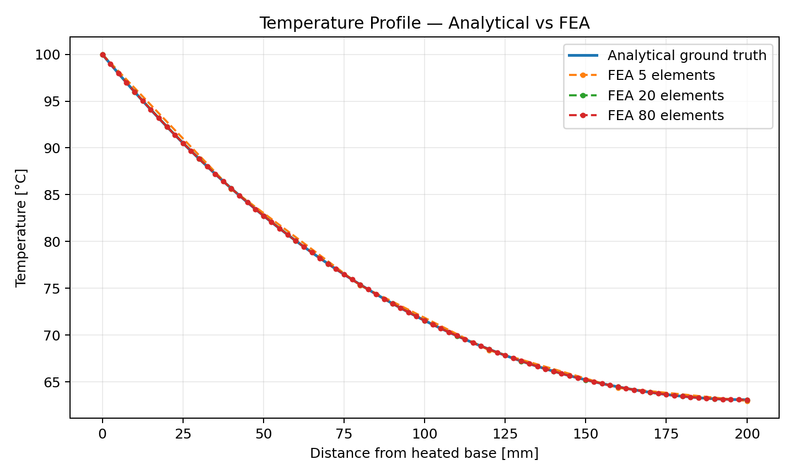

# Thermal FEA Ground-Truth Benchmark

A thermal-validation study of an aluminum cooling fin, comparing finite-element predictions against a closed-form fin solution and an energy-balance check.

## Problem
- Fin: 200 × 30 × 4 mm
- Thermal conductivity: 205 W/m·K
- Base temperature: 100 °C
- Ambient: 25 °C
- Convection coefficient: 15 W/m²·K

## Fine-mesh validation
- Analytical tip temperature: **63.0819 °C**
- FE tip temperature: **63.0815 °C**
- Tip-temperature error: **0.0012%**
- Analytical heat input: **10.23513 W**
- FE heat input: **10.23529 W**
- Heat-flow error: **0.0015%**
- Energy-balance error: approximately **0%**

The included numerical model is a transparent 1D thermal finite-element benchmark. `ansys_replication/` explains how to reproduce the same physics using the supplied 3D STEP geometry.
