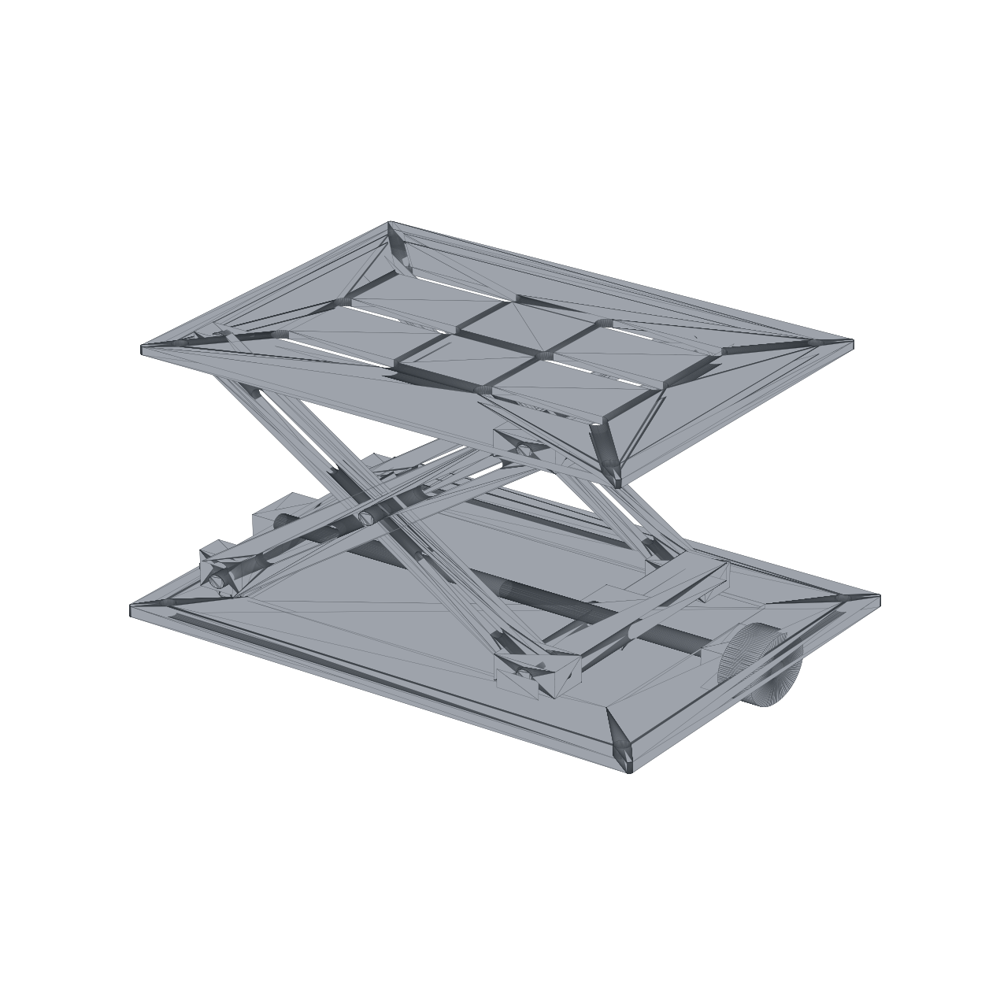

# Compact Scissor Lift — Mechanical Design Study

A self-initiated virtual mechanical-design project developed from requirements through CAD, analytical calculations, BOM, drawings and concept-stage validation.

## Design targets
- Rated centered payload: **10 kg**
- Base: 320 × 240 × 8 mm
- Top platform: 300 × 220 × 6 mm
- Scissor-arm pivot spacing: 260 mm
- Operating angle: 20°–60°
- Approximate theoretical linkage travel: 136 mm
- Manual TR12×3-type lead-screw concept

## Included work
- STEP assembly and individual components
- Kinematic and analytical load calculations
- Lead-screw force/torque and self-locking review
- BOM
- DXF manufacturing profiles
- Manufacturing drawing package
- Validation plots and prototype test plan

## Status and limits
This project is a **virtual design study**. Local FEA, physical prototyping, proof-load/endurance testing and safety certification were not performed. It must not be described as a manufactured or certified lifting device, and it is not intended for lifting people.
